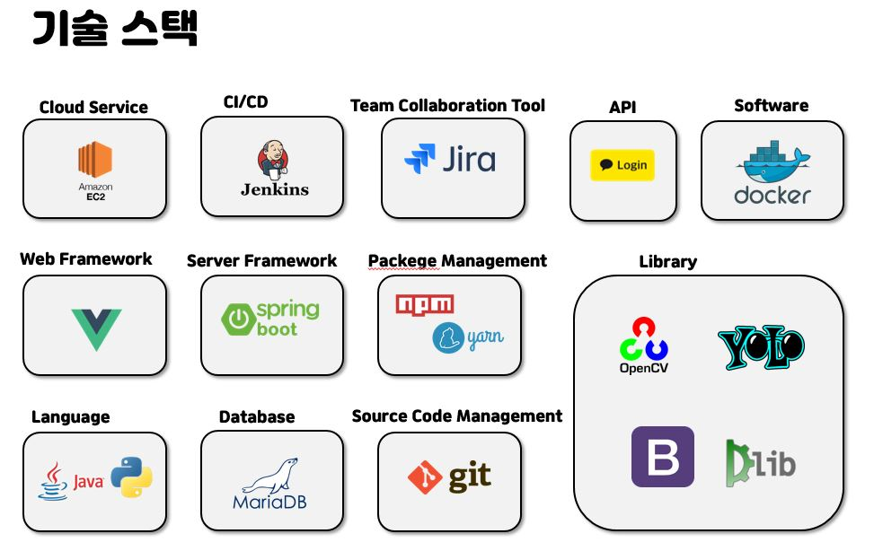
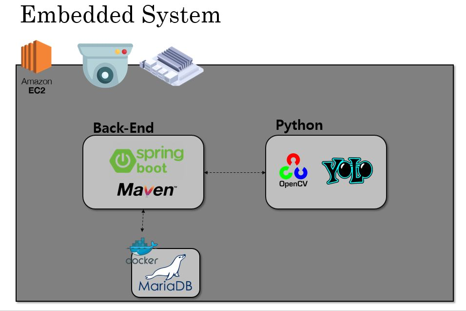
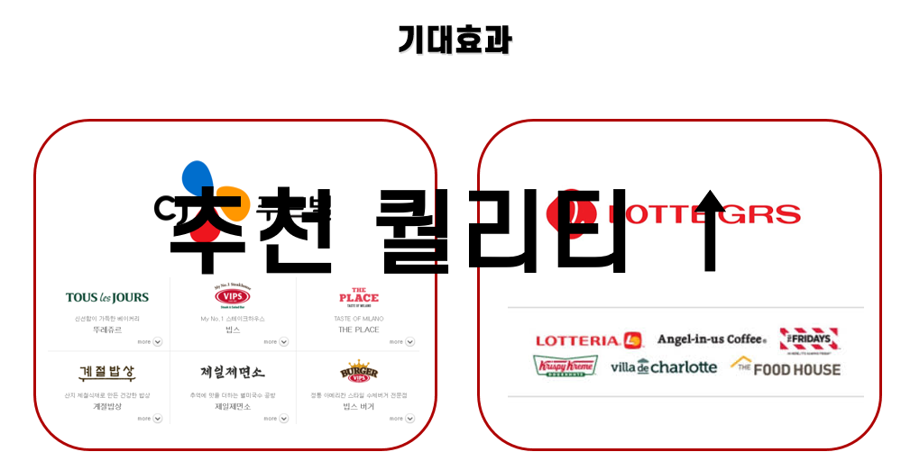

## [ 키완얼로 바로가기](https://k3b107.p.ssafy.io) :computer:

## 목차 :scroll:
- [개요](#개요)
- [기능](#기능)
- [구조도](#구조도)
	- [ERD](#erd)
- [기술 스택](#기술-스택)
- [향후 전망](#향후-전망)
- [팀소개](#팀소개)
	

 

## 개요 :black_nib:

 

#### :one: 매장 방문시 매일 귀찮게 QR 코드를 찍지 마세요 !

이젠 회원가입 한번이면 얼굴 인식을 통해 QR 코드 체크 없이 방문 기록을 남길 수 있습니다.

 

#### :two: 키오스크 사용시 메뉴 선택이 힘드셨죠 ?

최근 주문 메뉴, 현재 시간대 HOT 음료, 현재 시간대 HOT 푸드 를 추천 해줍니다.

 

### __:heart: 이제 키완얼을 사용하여 편하게 매장을 이용해 보세요 :heart:__

## 기능

#### 얼굴인식 :neutral_face:
>  OpenCV라는 실시간 이미지 프로세싱이 가능한 라이브러리를 이용하여, 고객의 얼굴에 68개의 특징점 찍어 얼굴을 검출하고, KNN classifier를 통해 이 얼굴은 누구인지를 인식

#### 객체탐지 :eyes:
> YOLO라는 객체 탐지 기술을 이용하여 다음과 같이 매장 내 사람을 포착할 수 있는 기술을 구현

#### 추천서비스 :poultry_leg: :pizza:
>  고객이 이전에 먹었던 메뉴 혹은 고객이 방문한 시간대의 인기 메뉴 등을 제공하고 더 많은 추천 서비스

 

## 기술 스택

 

* JAVA (jdk 1.8.0)
* Springboot (2.2.2)
* JPA
* Docker
* MariaDB
* Vue.js 
* BootStrap
* Python
* AWS
* openCV

 

## Web Architecture

## Embedded System

## 향후 전망

 

## 팀소개 :runner: :walking: 

   |  Name  |     Role      |
   | :----: | :-----------: | 
   | 박재림 | 백엔드 / 얼굴인식 |      
   | 김성웅 | 백엔드 / 객체 탐지 |  
   | 박수철 | 백엔드 / 서버 / 디버깅 | 
   | 이동현 | 프론트엔드 / 서버 / 키오스크 | 
   | 이진용 | 프론트엔드 / API / 회원관리 | 

 

